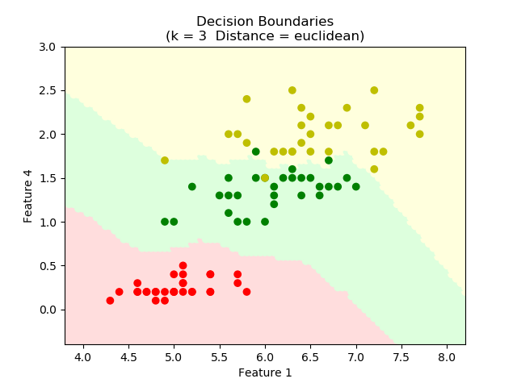
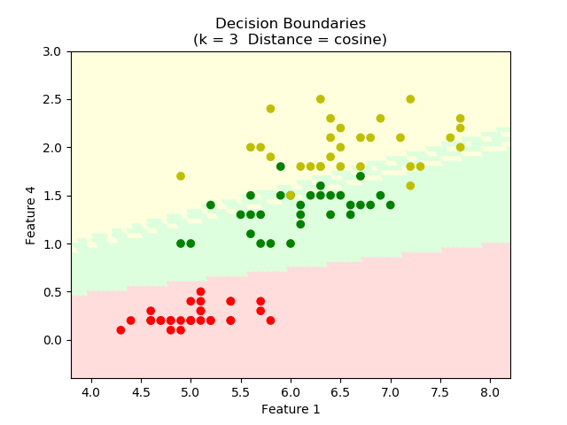

# kNearestNeighbors

This is first assignment of Introduction to Machine Learning (COMP 462) course. In this assignment, I implement k-NN classification algorithm from scratch and test it using the Iris dataset. The classifier has several main methods: fit, predict, accuracy and draw_decision_boundaries. Also it has two important input parameters:  
  1. **Number of Neighbors (k):** This is the k value in the k-NN algorithm.
  2. **Distance Metric:** Distance metric to be used to compute distances between samples. Distance metric can  be  Euclidean  distance,  Manhattan  distance, and Cosine Distance.

## Dataset ##
Iris dataset contains three flowers: Iris Versicolor, Iris Setosa, and Iris Virginica. Each flower has four features according its sepal and petal characteristic. In our assignment, I used first and fourth feature to fit the data and predict class label. 

In the iris dataset, each flower has 50 sample. I grouped all data according to its label and used 
first 30 sample for training, last 20 sample for test set.

## Classification Results ##
I tried different k values for each distance metrics and k-NN classification accuracies for different 
k and distance metrics given in Table 1. 
According to Table 1, Euclidean distance are most useful distance metric to classify our iris dataset, 
Cosine distance is the worst. In addition, the classifier classify the dataset in most optimal way 
for all distance metrics while k = 3. 

 

## Decision Boundaries ##
Our training data shown in Figure 1. In this step, I draw four decision boundaries with the following parameters: 
  * k=3, distance metric=Euclidean distance 
  * k=3, distance metric=Manhattan distance 
  * k=3, distance metric=Cosine distance 
  * k=1, distance metric=Euclidean distance 
  
  Figures for decision boundaries given in Figure 2 to Figure 5, respectively.
  
 
 

  <figcaption align="middle"> <pre>                                 Figure 1: Training samples on scatter plot</pre> </figcaption>

 
 

  <figcaption align="middle"> <pre>   Figure 2: Decision boundaries found by the k-NN algorithm (k=3, distance metric=Euclidean distance)</pre> </figcaption>

 
 

  <figcaption align="middle"> <pre>   Figure 3: Decision boundaries found by the k-NN algorithm (k=3, distance metric=Manhattan distance)</pre> </figcaption>

 
 

  <figcaption align="middle"> <pre>   Figure 4: Decision boundaries found by the k-NN algorithm (k=3, distance metric=Cosine distance )</pre> </figcaption>

 
 

  <figcaption align="middle"> <pre>   Figure 5: Decision boundaries found by the k-NN algorithm (k=1, distance metric=Euclidean distance )</pre> </figcaption>

